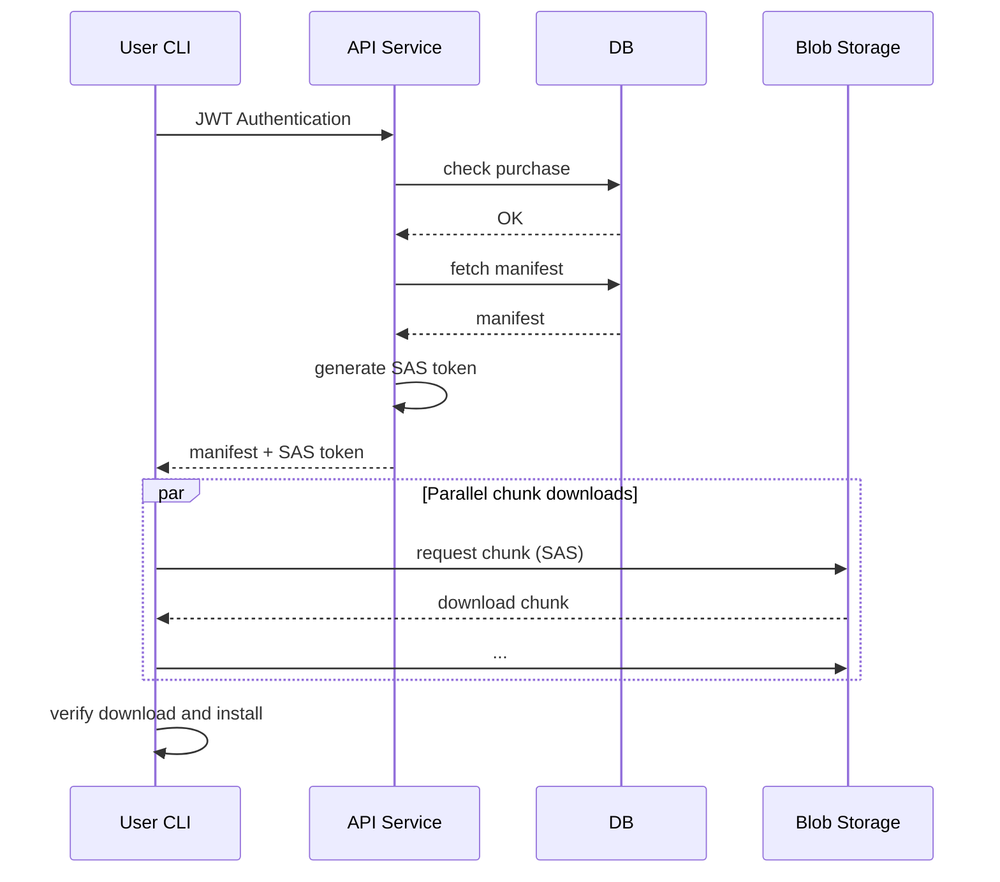
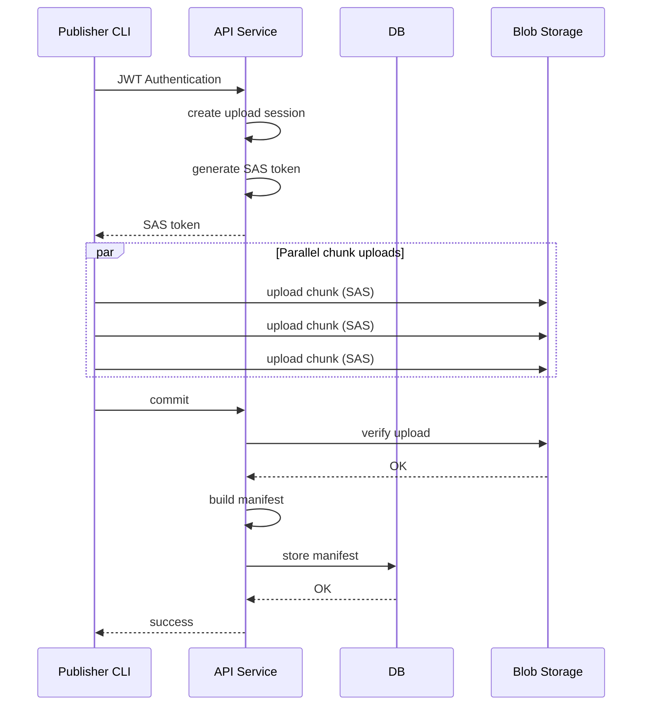

# Game Distribution Service - downme

## Introduction
Trying to build a Steam-like game distribution service/platform, will use CLI for front-end interaction allowing for user and game publishers to upload and download games 

Initial design idea -

*Side note: An Azure Shared Access Signature (SAS) token is a secure, signed URI string that grants delegated, time-limited access to Azure Storage resources (blobs, files, tables, queues) without exposing account keys*

## Let's separate - User and Publisher to get a better picture
### User Flows
- Game purchase flow is easy, user buys we write the successful purchase to db (not going to implement this)
- Game download flow is a task, we assume user has already purchased some games and its already updated in db


### Publisher Flows
- The publisher uploads game on the platform


*Everything below is AI generated - I'm pretty lazy at documentation* :wink:

## Additional details

`downme` is a local prototype of a game distribution system with:

- a FastAPI backend in `backend/`
- a Click-based CLI in `cli/`
- local SQLite storage for users, games, versions, manifests, and purchases
- Azure Blob Storage access wired for a local Azurite-style blob endpoint

Following functionality has been implemented:

1. register or login from the CLI
2. upload a game as an authenticated user
3. commit the upload so the backend stores a manifest
4. manually insert a purchase record for the user/game
5. list and download the game from the CLI

## Actual repo structure

- `backend/app.py`: FastAPI app and route registration
- `backend/services/`: API routes
- `backend/interfaces/`: auth, blob, game, and upload logic
- `backend/db.py`: SQLite engine and session setup
- `cli/downme.py`: CLI entrypoint
- `cli/interfaces.py`: CLI auth, upload, and download implementation
- `backend/.env`: local development settings currently used by `backend/config.py`

## Prerequisites

- Python 3.12
- `pip`
- A local Azure Blob Storage emulator or equivalent blob service

The code is currently configured for Azurite-style local blob storage at:

```text
http://127.0.0.1:10000/devstoreaccount1
```

No Azurite startup script is included in this repository, so that service must be started separately.

## Dependency installation

From the repository root:

```bash
python -m pip install -r requirements.txt
```

## Environment and config setup

The backend loads environment variables from:

```text
backend/.env
```

Important current behavior from the codebase:

- `backend/config.py` reads `backend/.env`
- `backend/db.py` does not use the config object and hardcodes SQLite to `sqlite:///./downme.db`
- because of that, the live database file is created as `downme.db` in whatever directory you start the backend from
- the practical way to run this repo is from the repository root so the database ends up at `./downme.db`

The checked-in `backend/.env` already contains local-development values for:

- `SECRET_KEY`
- `ALGORITHM`
- `DATABASE_URL`
- `AZURE_ACCOUNT_NAME`
- `AZURE_ACCOUNT_KEY`
- `AZURE_BLOB_ENDPOINT`
- `AZURE_CONN_STRING`

Two config notes matter:

- the current code reads `SESSION_TIMEOUT_MINUTES`, not `SESSION_TIMEOUT`
- the checked-in `.env` uses `SESSION_TIMEOUT`, so the backend currently falls back to the default timeout of 60 minutes

If you want to change the token timeout, add or replace:

```text
SESSION_TIMEOUT_MINUTES=60
```

## Required local services

### 1. SQLite

Nothing extra is required. The backend creates tables automatically on startup.

### 2. Blob storage emulator

This project expects a blob service compatible with these local values:

```text
Account name: devstoreaccount1
Blob endpoint: http://127.0.0.1:10000/devstoreaccount1
```

The upload and download flows depend on this service being available before you use the CLI.

## Backend startup

Run the API from the repository root:

```bash
python -m uvicorn backend.app:app --reload
```

Useful endpoint after startup:

```text
GET /hello/{user_name}
```

Tables are created automatically when the app starts.

## CLI usage

The most reliable way to run the CLI in the current repo is directly as a script:

```bash
python cli/downme.py --help
```

The CLI talks to this backend URL by default:

```text
http://127.0.0.1:8000
```

You can override it with:

```text
DOWNME_API_URL=http://host:port
```

The CLI stores state in:

```text
~/.downme/config.json
~/.downme/state/
```

`config.json` stores the JWT after login/register.

## Common run commands

Register a new user:

```bash
python cli/downme.py register
```

Login:

```bash
python cli/downme.py login
```

List games assigned to the logged-in user:

```bash
python cli/downme.py list
```

Upload a game file:

```bash
python cli/downme.py upload <game_name> <version> <path_to_file>
```

Upload a directory:

```bash
python cli/downme.py upload <game_name> <version> <path_to_directory>
```

Commit the uploaded game so the manifest is written to the database:

```bash
python cli/downme.py commit <game_name> <version>
```

Download a game:

```bash
python cli/downme.py download <game_name>
```

## Running from scratch

Recommended local test flow:

1. Start the local blob emulator separately.
2. Install Python dependencies with `python -m pip install -r requirements.txt`.
3. Start the backend with `python -m uvicorn backend.app:app --reload`.
4. Register a user with `python cli/downme.py register`.
5. Upload a game with `python cli/downme.py upload <game_name> <version> <path>`.
6. Commit it with `python cli/downme.py commit <game_name> <version>`.
7. Manually insert a purchase record for that user and game.
8. Run `python cli/downme.py list`.
9. Run `python cli/downme.py download <game_name>`.

## Important project note: manual purchase setup

The user-to-game assignment logic is not implemented.

To test the system, you must manually insert a record into the `purchases` table for the relevant user and game before `list` or `download` will work.

Helpful lookup queries:

```sql
SELECT user_id, username, role FROM users;
SELECT game_id, name, publisher_id FROM games;
```

Required insert:

```sql
INSERT INTO purchases (user_id, game_id) VALUES (<user_id>, <game_id>);
```

The backend uses the lowercase SQLite table name `purchases` even though the ORM model class is `Purchase`.

## Notes and current limitations

- There is no implemented purchase flow in the API or CLI.
- The backend auto-creates tables, but there are no migrations.
- The CLI upload flow lets any authenticated user create and upload a game; publisher role checks are currently commented out.
- User listing and download routes do require the logged-in account to have role `user`. New registrations default to role `user`.
- When uploading a directory, the CLI creates an in-memory tar archive, but the download is saved with a `.zip` filename. If you want the downloaded file to really be a zip, upload a zip file rather than a directory.
- The repository includes local helper scripts `local_test_blob.py` and `local_download_test.py` for direct blob testing against the local blob endpoint.
- The `cli/pyproject.toml` exists, but the direct script command `python cli/downme.py ...` is the safest documented way to run the CLI from this repository as it currently stands.
