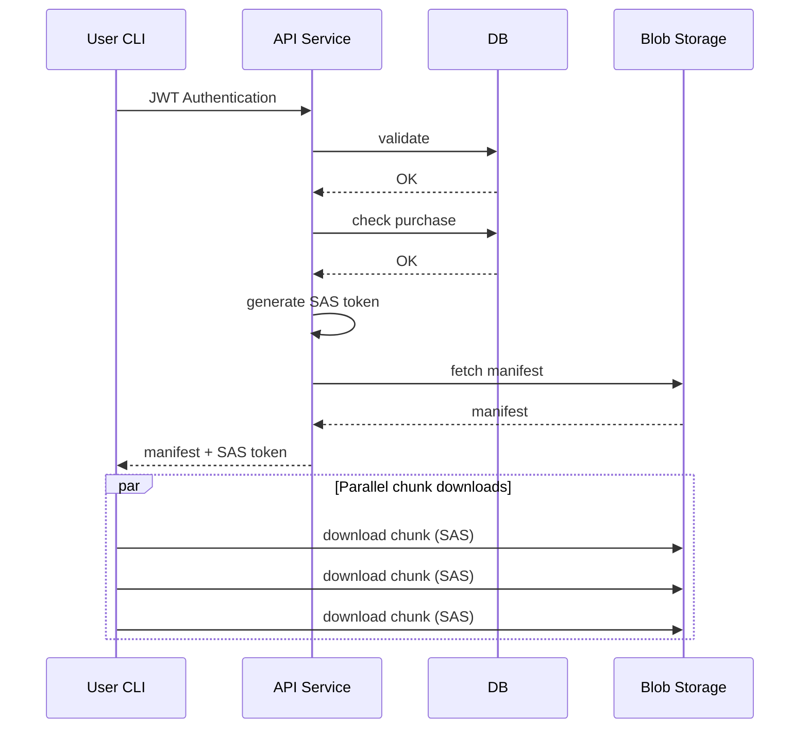
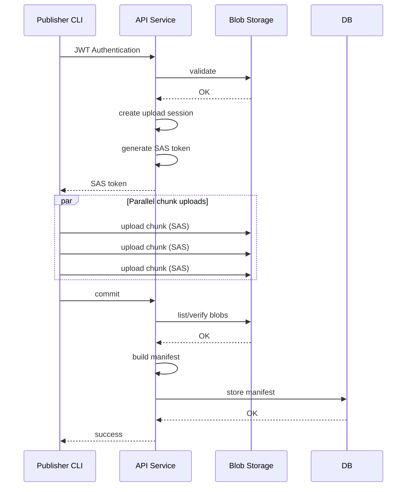

# Game Distribution Service - donwme

Trying to build a Steam-like game distribution service/platform, will use CLI for front-end interaction allowing for user and game publishers to upload and download games 

Initial design idea -

Let's separate - User and Publisher to get a better picture
### User Flows
- Game purchase flow is easy, user buys we write the successful purchase to db (not going to implement this)
- Game download flow is a task, we assume user has already purchased some games and its already updated in db

### Publisher Flows
- The publisher uploads game on the platform

